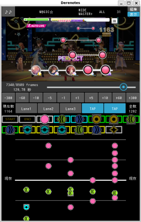
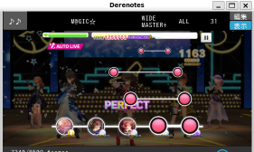
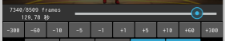
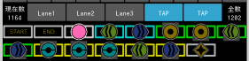
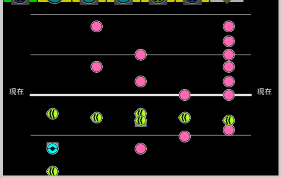

# デレステ譜面ファイル作成アプリ

デレステ楽曲の譜面データを`手作業`で作成しファイルに保存する。
入力として、オートLIVEを録画したデレステ動画ファイルを用いる。

* 推奨のファイル形式
mp4（他のファイル形式は、未対応）
* 推奨のエンコード形式
H.264/AVC (ほぼほぼコレのはず)で、 60fps

> 楽曲の開始フレームを特定するために、特技の発動間隔の判っているアイドルを構成したユニットでオートLIVEを行うことをお勧めする。

## 画面説明みたいな操作説明

### デレステ動画フレーム表示

実際に降ってくるノートをデレステ動画のフレーム単位で表示します。
上段の「♪♪」ボタンで、ファイルメニューを開く。

### デレステ動画フレームシーク

`デレステ動画フレーム表示`のフレームをシーク（移動）します。
上段のバーをスライドすると大きくジャンプします。
下段のボタンをクリックすると、数字分だけフレームをシーク（移動）します。

### デレステ譜面ノート入力

ゲーム時にタップするように`デレステ動画フレーム表示`にフレームが表示されたところで、上段のボタンをクリックして`ノート`を入力します。もう一度クリックすると削除します。
下段のアイコンで入力したい`ノート`アイコンを選択します。

> もっと良い入力方法が無いものかな？

### デレステ譜面表示

入力済みのデレステ譜面が表示します。
`デレステ動画フレーム表示`のフレームの前後1秒分ずつ表示します。
ゲーム画面と違って、ペアのラインやロング・スライドラインは表示しません。

## インストール手順

### 前準備

Python仮想環境を用意する。

~~~shell
mkdir derenotes
cd derenotes

python -m venv venv --upgrade-deps
~~~

> FFMpeg共有ライブラリィも必要です。

### インストール

~~~shell
cd derenotes

. venv/bin/activate
pip install git+https://github.com/tomosatoP/derenotes.git
~~~

> 予定：GitHub actions CI/CD workflow で自動ビルド。
現状：`python -m build --wheel` & `pip install .` で行う。

### 実行

~~~shell
cd derenotes

. venv/bin/activate
python -m derenotes
~~~
